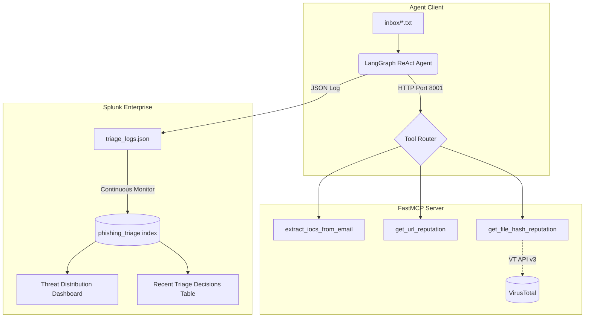

# Autonomous Tier 1 Phishing Triage Pipeline


---

## Executive Summary

Phishing remains the primary initial access vector for enterprise breaches. Typically, a Tier 1 analyst in a Security Operations Center (SOC) checks sender reputation, extracts URLs, queries threat intel, and logs a verdict. This process takes 10 to 20 minutes for each alert. At high volumes, it becomes hard to manage, leading to inconsistent results from analyst fatigue.

This project automates that workflow with a new pipeline. A LangGraph ReAct agent monitors the local inbox. It sends phishing emails to a specialized MCP tool server for IOC extraction and live VirusTotal checks. Then, it creates structured JSON verdicts directly in a Splunk SIEM. This method ensures a consistent decision in under a minute for each email. Each log event includes a correlation ID for easy investigation later.

**Target reduction:** Tier 1 manual triage time from ~15 minutes per alert to under 60 seconds, with zero analyst involvement for clear-cut cases.

---


## Dashboard Preview


*Single Pane of Glass dashboard showing the Threat Distribution pie chart (malicious vs. benign verdict breakdown) and the Recent Triage Decisions queue, populated from live Splunk queries against the `phishing_triage` index.*

**SPL queries used:**

```spl
# Threat distribution pie chart
index="phishing_triage" event_action="complete_triage_task"
| stats count by threat_verdict

# Recent triage decisions table
index="phishing_triage" event_action="complete_triage_task"
| table _time, source_file, threat_verdict, threat_summary
| sort -_time
```

## Project Structure

```
C:\phishing-triage\
├── mcp_server.py          # FastMCP server exposing 3 triage tools
├── agent_client.py        # LangGraph ReAct batch processing agent
├── triage_logs.json       # SIEM log file (append-only, Splunk monitored)
├── inbox\                 # Drop .txt email files here for processing
├── archive\               # Processed emails moved here automatically
├── .env                   # API keys (not committed)
├── .gitignore
└── pyproject.toml
```


### Data Flow Summary

1. Drop `.txt` email files into `inbox/`
2. Agent reads each file, invokes MCP tools sequentially via HTTP
3. MCP server extracts IOCs (Regex), checks URL reputation, queries VirusTotal for file hashes
4. Agent synthesizes tool results into a structured `PhishingAnalysis` Pydantic model (`verdict` + `summary`)
5. `python-json-logger` writes the verdict to `triage_logs.json` with full correlation metadata
6. Splunk ingests the log file in real time; the dashboard updates automatically
7. Processed email is moved to `archive/`

### Log Schema

Every triage decision produces a JSON event with the following fields:

| Field | Description |
|---|---|
| `timestamp` | ISO-format event time |
| `log_level` | Severity (`INFO`, `WARNING`, `ERROR`) |
| `message` | Human-readable summary |
| `agent_id` | Static agent identifier |
| `model_id` | LLM used for inference |
| `principal_user_id` | Analyst account that triggered the run |
| `event_correlation_id` | UUID linking all tool calls within one triage session |
| `event_action` | Action type (e.g., `complete_triage_task`) |
| `threat_verdict` | `malicious` \| `suspicious` \| `benign` |
| `threat_summary` | Agent-generated prose explanation |
| `source_file` | Originating email filename |

---

## Technical Stack

| Component | Technology |
|---|---|
| Runtime | Python 3.12, `uv` package manager |
| Agent Framework | LangGraph (`create_react_agent`) |
| LLM | Google Gemini (`gemini-3-flash-preview`) via `langchain-google-genai` |
| MCP Server | FastMCP (`streamable-http` transport, port 8001) |
| MCP Client | `langchain-mcp-adapters` (`MultiServerMCPClient`) |
| Threat Intel | VirusTotal API v3 (`requests`) |
| Structured Logging | `python-json-logger` with custom formatter |
| SIEM | Splunk Enterprise (local), `phishing_triage` index |

---

## Prerequisites

- Python 3.12+
- [`uv`](https://github.com/astral-sh/uv) package manager
- A [Google AI Studio](https://aistudio.google.com) API key (free tier supported)
- A [VirusTotal](https://www.virustotal.com) API key (free tier supported)
- Splunk Enterprise (local install, for SIEM integration)

---

## Setup

### 1. Clone and initialize

```powershell
git clone https://github.com/eabboa/phishing-triage.git
cd C:\phishing-triage
uv sync
```

> **Note:** Deploy the project root at `C:\phishing-triage\`. Splunk's service account runs under the `SYSTEM` user and cannot access paths under `C:\Users\`. Any other root path will cause Splunk ingestion to fail with a `Path is not readable` error.

### 2. Configure environment variables

Create a `.env` file in the project root:

```env
GOOGLE_API_KEY=your_google_ai_studio_key_here
VT_API_KEY=your_virustotal_api_key_here
```

> **Key naming:** `langchain-google-genai` resolves `GOOGLE_API_KEY`. The variable name `GEMINI_API_KEY` is not recognized by the library and will raise a Pydantic `ValidationError` at startup.

### 3. Create the inbox and archive directories

```powershell
mkdir C:\phishing-triage\inbox
mkdir C:\phishing-triage\archive
```

### 4. Configure Splunk

1. **Create a dedicated index:** `Settings → Indexes → New Index`. Name it `phishing_triage`.
2. **Add a data input:** `Settings → Data Inputs → Files & Directories → New Local File & Directory`.
   - Path: `C:\phishing-triage\triage_logs.json`
   - Monitoring: `Continuously Monitor`
   - Source type: `_json`
   - Index: `phishing_triage`
3. Verify ingestion with: `index="phishing_triage"`

---

## Usage

### Terminal 1 — Start the MCP server

```powershell
cd C:\phishing-triage
uv run python mcp_server.py
```

The server binds to `http://127.0.0.1:8001/mcp`. Leave this running.

### Terminal 2 — Run the batch triage agent

Drop one or more `.txt` email files into `C:\phishing-triage\inbox\`, then run:

```powershell
cd C:\phishing-triage
uv run python agent_client.py
```

The agent processes each file sequentially, prints the verdict to the terminal, appends the full structured event to `triage_logs.json`, and moves the file to `archive/`.

**Example output (terminal):**

```
Found 2 emails in inbox. Starting batch triage...

Scanning: email1.txt
Verdict: BENIGN. Moved to archive.

Scanning: email2.txt
Verdict: MALICIOUS. Moved to archive.

Batch processing complete.
```

**Example log event (triage_logs.json):**

```json
{
  "message": "Completed phishing triage task for email2.txt.",
  "agent_id": "phishing-triage-agent-01",
  "agent_name": "PhishingTriageAssistant",
  "model_id": "gemini-3-flash-preview",
  "principal_user_id": "soc_analyst_jane_doe",
  "event_correlation_id": "220f55bb-edb3-4d9e-bd80-ae0e92d7a7c3",
  "event_action": "complete_triage_task",
  "threat_verdict": "malicious",
  "threat_summary": "The email contains a file hash flagged as malicious malware by 42 security vendors. It also uses social engineering tactics like urgency and claims of suspicious activity.",
  "source_file": "email2.txt",
  "timestamp": "2026-04-05 15:59:48,533",
  "log_level": "INFO"
}
```

---

## Lessons Learned

These are the concrete engineering problems encountered during the build, and how each was resolved.

### 1. Environment variable naming mismatch

**Problem:** The `.env` file was configured with `GEMINI_API_KEY`, but the `langchain-google-genai` library resolves only `GOOGLE_API_KEY`. This produced a Pydantic `ValidationError` at initialization not a missing key warning making the root cause non-obvious.

**Fix:** Rename the variable to `GOOGLE_API_KEY` in `.env`. The `GEMINI_API_KEY` name is not supported by the LangChain Google GenAI integration.

---

### 2. `MultiServerMCPClient` async context manager removal

**Problem:** Using `async with client:` raised `NotImplementedError` after upgrading to `langchain-mcp-adapters>=0.1.0`. The async context manager pattern was deprecated and removed in that release.

**Fix:** Remove the `async with` block. Initialize the client, set `client.connections` directly, and call `await client.get_tools()` on the plain client object:

```python
client = MultiServerMCPClient()
client.connections = {
    MCP_SERVER_NAME: StreamableHttpConnection(
        transport="streamable_http",
        url="http://localhost:8001/mcp",
        session_kwargs={"logging_callback": ...}
    )
}
tools = await client.get_tools()
```

---

### 3. Port conflict between Splunk Web and FastMCP

**Problem:** FastMCP's default port (`8000`) conflicted with the Splunk Web interface, which also binds to `8000` on a default local install.

**Fix:** Migrate the MCP transport to port `8001` by modifying the server entrypoint and updating the client connection URL:

```python
# mcp_server.py
mcp.run(transport="streamable-http", port=8001)

# agent_client.py
url="http://localhost:8001/mcp"
```

---

### 4. Windows ACL blocking Splunk file ingestion

**Problem:** Splunk's data input raised `Parameter name: Path is not readable` when pointed at `C:\Users\enesa\phishing-triage\triage_logs.json`. Splunk Enterprise runs its service under the `SYSTEM` account, which does not have read access to paths under `C:\Users\` by default on Windows 11.

**Fix:** Move the entire project to `C:\phishing-triage\`. Paths under the drive root are accessible to the `SYSTEM` user without any ACL modification. Update all hardcoded paths in `agent_client.py` and reconfigure the Splunk data input to point to the new location.

---

### 5. Gemini Free Tier rate limiting (HTTP 429)

**Problem:** Processing a batch of more than ~5 emails in rapid succession hit the Gemini Free Tier daily quota (`GenerateRequestsPerDayPerProjectPerModel-FreeTier`, limit: 20 requests). The error surface was a `RESOURCE_EXHAUSTED` exception mid-batch, leaving remaining emails unprocessed.

**Fix:** Insert an `asyncio.sleep(5)` between each email in the batch loop. This keeps throughput within the 15 RPM free tier ceiling and prevents mid-batch failures without requiring a paid API plan for a development environment.

```python
# Free tier rate limit protection (15 RPM max)
await asyncio.sleep(5)
```

For production deployments, replace with a paid Gemini API key and implement proper exponential backoff with jitter.

---

## Future Roadmap

The current pipeline handles commodity phishing, malicious URLs, and known-bad file hashes. The following attack vectors require additional detection logic and are planned for future iterations:

- **QR code phishing (quishing):** URLs embedded in images bypass regex-based IOC extraction entirely. Mitigation requires an OCR or multimodal vision step before the IOC extraction tool is invoked.

- **Living-off-the-land payload hosting:** Attackers increasingly host payloads on legitimate infrastructure (SharePoint, OneDrive, GitHub). File hash reputation checks will return benign results. Detection requires behavioral sandboxing integration (e.g., VirusTotal file submission, Any.run API) rather than static hash lookup.

- **Attachment parsing:** The current pipeline processes email body text only. A future `parse_attachment` MCP tool should handle `.pdf`, `.docx`, and `.html` attachment types, extracting embedded IOCs before reputation checks.

- **Alerting integration:** Wire Splunk alert actions (or a Webhook) to a ticketing system (Jira, TheHive) so that `malicious` verdicts automatically open an incident with the correlation ID pre-populated.

---
