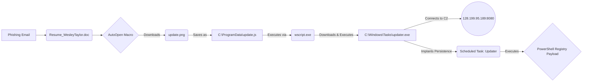

### DFIR: Memory Analysis of Macro-Enabled Phishing and C2 Persistence

**Date:** 2026-04-14  

**Author:** Enes Arda Baydaş

**Domain:** Incident Response  
 
**Environment:** TryHackMe (Boogeyman 2)  

**MITRE ATT&CK:** Spearphishing Attachment (T1566.001), Command and Scripting Interpreter: Visual Basic (T1059.005), JavaScript (T1059.007), Obfuscated Files or Information (T1027), Scheduled Task/Job: Scheduled Task (T1053.005), Application Layer Protocol: Web Protocols (T1071.001)   

---

### Executive Summary
Quick Logistics LLC suffered a secondary compromise resulting from a spear-phishing email containing a malicious Microsoft Office attachment. Memory analysis revealed the Base64-encoded document utilized VBA macros to execute a JavaScript dropper, which subsequently downloaded and executed a persistent command-and-control (C2) payload. 

**Risk Rating: High.** The threat actor successfully bypassed initial gateway controls, executed arbitrary code via Living-off-the-Land Binaries (wscript.exe), and established daily persistence via the Windows Registry and Scheduled Tasks. 



---

### Key Artifacts & Signatures

| Type (IOC / Artifact / Query) | Value / Location | Context & Significance |
|-------------------------------|------------------|------------------------|
| Phishing Sender | `westaylor23@outlook.com` | Source of the malicious spear-phishing email. |
| Malicious Attachment (MD5) | `52c4384a0b9e248b95804352ebec6c5b` | `Resume_WesleyTaylor.doc`. Contains Base64 OLE macro. |
| Stage 2 Dropper URL | `https://files.boogeymanisback.lol/aa2a9c53cbb80416d3b47d85538d9971/update.png` | Accessed via `Microsoft.XMLHTTP` by the VBA macro. |
| Dropped Script File | `C:\ProgramData\update.js` | Executed via `wscript.exe` by the macro. |
| Stage 3 Payload URL | `https://files.boogeymanisback.lol/aa2a9c53cbb80416d3b47d85538d9971/update.exe` | Fetched by the JavaScript dropper. |
| Executable Payload | `C:\Windows\Tasks\updater.exe` | Primary C2 binary. |
| C2 IP Address & Port | `128.199.95.189:8080` | Active TCP connection established by `updater.exe`. |
| Persistence Mechanism | Task: `Updater` / Reg: `HKCU\Software\Microsoft\Windows\CurrentVersion\debug` | Daily scheduled task at 09:00 running a Base64 encoded PowerShell payload from the registry. |

---

### Defense Posture Summary

| Gap / Capability | Impact | Recommended Action / Result |
|------------------|--------|-----------------------------|
| Email Gateway / Attachment Filtering | Allowed weaponized `.doc` file to reach the user inbox. | Implement strict MIME-type blocking for legacy Office files and enforce external sender tagging. |
| Endpoint Execution Controls | `WINWORD.EXE` successfully spawned `wscript.exe`. | Deploy Microsoft Attack Surface Reduction (ASR) rules to block Office applications from creating child processes. |
| Network Egress Filtering | Allowed outbound C2 traffic over port 8080. | Enforce default-deny outbound firewall rules and proxy-level threat intelligence blocking for known malicious domains. |

---

### Technical Analysis

**Trigger / Hypothesis**
Following a suspected phishing attack against an employee (maxine.beck), a forensic memory dump (`WKSTN-2961.raw`) and a copy of the phishing email were provided for triage and analysis. The objective was to determine the extent of the compromise, identify the payloads, and uncover the persistence mechanism.

**Analytical Execution**
Extraction of the email attachment revealed a Base64-encoded OLE2 Microsoft Office document (`Resume_WesleyTaylor.doc`). Static analysis of the decoded OLE stream utilizing `olevba` identified a malicious `AutoOpen` macro. 


The macro leveraged `Microsoft.XMLHTTP` to download a file named `update.png` from `files.boogeymanisback.lol` and utilized `Adodb.Stream` to save it to disk as a JavaScript file (`C:\ProgramData\update.js`). It subsequently executed this script using `WScript.Shell`. Memory analysis via Volatility's `pslist` plugin confirmed this execution chain, showing `wscript.exe` (PID 4260) spawned as a child process of `WINWORD.EXE` (PID 1124).

```
ubuntu@tryhackme:~/Desktop/Artefacts$ vol -f WKSTN-2961.raw windows.pslist.PsList
(-->) 4336	1124	WINWORD.EXE	0xe58f87547080	0	-	3	False	2023-08-21 14:12:34.000000 	2023-08-21 14:12:45.000000 	Disabled
4776	828	WmiPrvSE.exe	0xe58f875020c0	9	-	0	False	2023-08-21 14:12:34.000000 	N/A	Disabled
6592	3912	SearchProtocol	0xe58f8635f080	0	-	0	False	2023-08-21 14:12:38.000000 	2023-08-21 14:15:07.000000 	Disabled
4260	1124	wscript.exe	0xe58f864ca0c0	6	-	3	False	2023-08-21 14:12:47.000000 	N/A	Disabled
6216	4260	updater.exe	0xe58f87ac0080	18	-	3	False	2023-08-21 14:12:48.000000 	N/A	Disabled
4464	6216	conhost.exe	0xe58f84bd1080	5	-	3	False	2023-08-21 14:14:03.000000 	N/A	Disabled
6332	6932	DumpIt.exe	0xe58f87a870c0	3	-	3	True	2023-08-21 14:14:25.000000 	N/A	Disabled
```

Further memory forensics utilizing Volatility's `filescan` and `dumpfiles` plugins recovered the `update.js` script from the memory space. Analysis of the script's contents revealed it utilized `MSXML2.XMLHTTP` to retrieve a secondary executable payload (`update.exe`) from the same malicious domain, dropping it at `C:\Windows\Tasks\updater.exe` and executing it. 

Network connection analysis against the memory dump (`windows.netscan`) identified the `updater.exe` process (PID 6216) actively communicating with a Command and Control (C2) server at `128.199.95.189` over port `8080`. 

```
0xe58f8760dbf0	TCPv4	10.10.49.181	63298	128.199.95.189	8080	CLOSED	6216	updater.exe	2023-08-21 14:14:24.000000
```

To determine how the attacker maintained access, "strings" analysis was performed on the memory dump targeting `schtasks`. This revealed a persistence mechanism implanted immediately after the C2 callback. The attacker created a scheduled task named `Updater`, set to trigger daily at `09:00`. The task executes `powershell.exe` to decode and run a fileless payload stored directly in the registry at `HKCU\Software\Microsoft\Windows\CurrentVersion\debug`.

```
schtasks /Create /F /SC DAILY /ST 09:00 /TN Updater /TR 'C:\Windows\System32\WindowsPowerShell\v1.0\powershell.exe -NonI -W hidden -c \"IEX ([Text.Encoding]::UNICODE.GetString([Convert]::FromBase64String((gp HKCU:\Software\Microsoft\Windows\CurrentVersion debug).debug)))\
```

**Threat Mechanics**
The threat actor demonstrated a sophisticated chain relying heavily on "Living off the Land" (LotL) techniques. By utilizing native Windows executables (`wscript.exe`, `schtasks.exe`, `powershell.exe`) and avoiding dropping traditional compiled malware for the final persistence stage, the attacker minimized their footprint. Storing the persistent payload encoded within the Windows Registry rather than on the filesystem (fileless malware) is a deliberate defense evasion tactic designed to bypass traditional file-based anti-virus scanning and complicate forensic recovery.

---

### Remediation & Hardening

**Immediate Response**
1.  Isolate the compromised workstation (`WKSTN-2961`) from the corporate network immediately.
2.  Block the identified C2 IP address (`128.199.95.189`) and the malicious domain (`files.boogeymanisback.lol`) at the perimeter firewall and web proxy.
3.  Remove the `Updater` scheduled task and delete the associated malicious registry key `HKCU\Software\Microsoft\Windows\CurrentVersion\debug`.

**Structural Engineering**
* Implement Microsoft ASR Rule: *Block all Office applications from creating child processes*. This breaks the initial VBA macro execution chain.
* Change the default file association for `.js` and `.vbs` files to open in Notepad rather than Windows Script Host, preventing accidental execution of droppers by end-users.
* Enable and ingest PowerShell Script Block Logging (Event ID 4104) into the SIEM to capture the execution of obfuscated and fileless registry payloads.
