### DFIR: Tracking Follina (CVE-2022-30190) Exploitation to PrintSpoofer Privilege Escalation

**Date:** 2026-03-27  

**Author:** Enes Arda Baydaş  

**Domain:** Incident-Response 

**Environment:** TryHackMe (Tempest)  

**MITRE ATT&CK:** T1566.001 (Spearphishing Attachment), T1203 (Exploitation for Client Execution), T1059.001 (PowerShell), T1090.001 (Internal Proxy), T1134.001 (Token Impersonation/Theft), T1136.001 (Local Account), T1543.003 (Windows Service)  

**GRC Mapping:** NIST CSF PR.AC-4 (Access Control), DE.AE-2 (Anomalous Activity Detection), PR.PT-4 (Least Privilege)

---

```mermaid
flowchart LR
classDef input fill:#4A90D9,color:#fff
classDef process fill:#6B7280,color:#fff
classDef decision fill:#F59E0B,color:#fff
classDef output fill:#10B981,color:#fff

id1([Malicious Doc Opened]):::input --> id2[Follina MSDT Exploit]:::process
id2 --> id3[Download update.zip]:::process
id3 --> id4[Execute first.exe C2]:::process
id4 --> id5[Network Recon and Creds]:::process
id5 --> id6[Run ch.exe Proxy]:::process
id6 --> id7{Is System?}:::decision
id7 -->|No| id8[Run PrintSpoofer]:::process
id8 --> id9[Gain System Token]:::process
id9 --> id10[Create Admin Users]:::process
id7 -->|Yes| id10
id10 --> id11[[Add TempestUpdate2]]:::output
```

### Executive Summary
An investigation into a critical SOC alert revealed the compromise of a Windows endpoint via a malicious `.doc` file weaponizing the Follina vulnerability (CVE-2022-30190). The threat actor successfully established a reverse SOCKS proxy using Chisel, escalated to SYSTEM privileges using PrintSpoofer, and secured persistence by creating rogue local administrator accounts and a persistent Windows service. 

**Risk Rating:** Critical. The adversary achieved full system compromise (SYSTEM privileges) and established multiple layers of persistence.

---

### Key Artifacts & Signatures

| Type | Value / Location | Context & Significance |
|---|---|---|
| Malicious Doc (MD5) | `3BB23AD386E59304088DFD5AB05818C5` | Initial delivery mechanism (`free_magicules.doc`) triggering Follina. |
| C2 Payload URL | `hxxp[://]phishteam[.]xyz/02dcf07/update[.]zip` | Stage 2 payload retrieved via Follina `Invoke-WebRequest` execution. |
| C2 Server (Chisel) | `167.71.199.191:8080` | IP and port utilized for the reverse SOCKS proxy connection. |
| Chisel Binary (SHA256) | `8A99353662CCAE117D2BB22EFD8C43D7169060450BE413AF763E8AD7522D2451` | Tool (`ch.exe`) executed to tunnel traffic back to the C2. |
| PrintSpoofer (SHA256) | `8524FBC0D73E711E69D60C64F1F1B7BEF35C986705880643DD4D5E17779E586D` | Privilege escalation binary (`spf.exe`) abusing `SeImpersonatePrivilege`. |
| Persistence (Accounts) | `shuna`, `shion` | Rogue local accounts created and added to the Administrators group. |
| Persistence (Service) | `TempestUpdate2` | Malicious service configured to auto-start `final.exe`. |

---

### Defense Posture Summary

| Gap / Capability                        | Impact                                                                                        | Recommended Action / Result                                                                                  |
| --------------------------------------- | --------------------------------------------------------------------------------------------- | ------------------------------------------------------------------------------------------------------------ |
| **Capability:** Sysmon Logging          | Process creation (EID 1) and network connections (EID 3) captured the entire execution chain. | Maintained visibility for forensic reconstruction.                                                           |
| **Capability:** Network Traffic Capture | PCAP allowed extraction of plaintext HTTP C2 traffic and base64 payloads.                     | Enabled rapid identification of automated enumeration scripts and compromised credentials.                   |
| **Gap:** Perimeter Defenses             | Follina payload successfully executed the `msdt.exe` protocol bypass.                         | Implement ASR rules to block Office apps from creating child processes and apply CVE-2022-30190 mitigations. |

---

### Technical Analysis & Narrative

**Trigger / Hypothesis** The investigation originated from a critical severity SOC alert indicating a malicious document download via Chrome (`chrome.exe`), resulting in subsequent suspicious code execution.

**Analytical Execution** Log analysis via EvtxECmd and Timeline Explorer confirmed the execution of `free_magicules.doc` (PID 496). Process creation events revealed the document spawned `msdt.exe` with the anomalous `IT_RebrowseForFile` parameter, confirming exploitation of CVE-2022-30190 (Follina). The exploit passed a base64-encoded PowerShell command that downloaded `update.zip` from `phishteamxyz` and unpacked `first.exe` into the Startup folder. 

Upon user login, `first.exe` executed, initiating HTTP C2 communication with `resolvecyber.xyz`. PCAP analysis of the HTTP traffic revealed the adversary utilizing base64-encoded parameters in URI requests to exfiltrate command outputs. Decoded traffic exposed internal reconnaissance (`netstat -ano -p tcp`) targeting WinRM (port 5985) and the discovery of hardcoded credentials (`infernotempest`) within an administrative script (`automation.ps1`).

To establish a stable tunnel, the adversary downloaded and executed Chisel (`ch.exe`), establishing a reverse SOCKS proxy to `167.71.199.191:8080`. Subsequently, the attacker dropped `spf.exe` (PrintSpoofer) to elevate privileges from the compromised user context to `NT AUTHORITY\SYSTEM`. Operating with SYSTEM privileges, the adversary achieved persistence by creating two local users (`shuna`, `shion`), adding them to the local Administrators group via `net.exe`, and creating an auto-starting service named `TempestUpdate2` that executes `final.exe`.

**Threat Mechanics** CVE-2022-30190 bypasses standard macro security features by utilizing an external OLE relationship in a Word document to load a remote HTML template containing the `ms-msdt:` URI scheme. This forces the Microsoft Support Diagnostic Tool to execute arbitrary PowerShell with the privileges of the calling application without requiring a passcode. For privilege escalation, PrintSpoofer abuses `SeImpersonatePrivilege`—typically assigned to service accounts—by forcing the Print Spooler service to connect to a rogue named pipe, allowing the attacker to impersonate the SYSTEM token and execute commands.

---

### Open Threads & Limitations

* Initial delivery vector context (e.g., the specific phishing email or URL that led to the Chrome download) was outside the scope of the provided endpoint logs.

---

### Remediation & Hardening

**Immediate Response**
1.  Isolate the compromised endpoint (`TEMPEST`) from the network to sever the Chisel SOCKS proxy connection.
2.  Delete the rogue local administrative accounts (`shuna`, `shion`).
3.  Remove the persistent `TempestUpdate2` service and delete associated binaries (`final.exe`, `ch.exe`, `spf.exe`, `first.exe`).
4.  Reset the compromised user's password and the `infernotempest` credential exposed in the automation script.
5.  Block the identified C2 IP (`167.71.199.191`) and domains (`phishteamxyz`, `resolvecyber.xyz`) at the perimeter firewall.

**Structural Engineering**
* **Follina Mitigation:** Delete the `ms-msdt` registry key to prevent the diagnostic tool from being invoked via URI, or ensure the official Microsoft patches for CVE-2022-30190 are applied fleet-wide.
* **ASR Rules:** Implement Attack Surface Reduction (ASR) rules to block all Office applications from creating child processes.
* **Detection Engineering:** Create SIEM alerts monitoring for `net.exe` and `net1.exe` usage combined with `/add` and `localgroup administrators` parameters to rapidly detect post-exploitation account creation.
